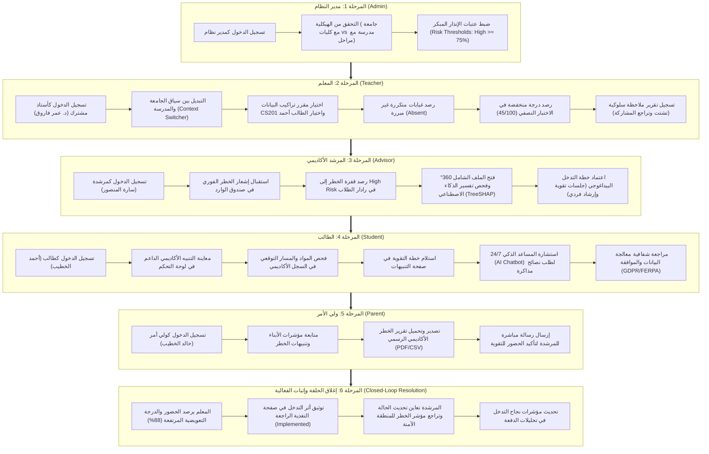

# 📘 دليل سيناريو التشغيل والاختبار التكاملي الشامل لمنصة تحليل سلوك الطلاب والتنبؤ بالتعثر (SBA)
## Comprehensive End-to-End Interconnected System Testing & Demonstration Playbook

---

## 🎯 الغرض من هذا الدليل (Executive Summary)

يقدم هذا الدليل **سيناريو تشغيلياً واختبارياً تكاملياً وشاملاً (End-to-End Interconnected Flow)** يربط جميع أدوار النظام في مسار واقعي متسلسل يشبه أحجار الدومينو؛ حيث يؤدي كل إجراء يتخذه مستخدم معين (Actor) إلى تأثير مباشر وملموس يظهر في حساب المستخدم التالي.

تم إعداد هذا الدليل لتمكين فرق الفحص، ولجان التحكيم، وأصحاب المصلحة (Stakeholders) من:
1. **اختبار النظام بشكل حي ومباشر** عبر واجهات المستخدم الأمامية (Front-End) وقاعدة البيانات والخلفية البرمجية (Back-End).
2. **إثبات الفعالية العملية لنماذج الذكاء الاصطناعي (XGBoost / LightGBM)** في التنبؤ المبكر بالتعثر قبل وقوعه وتفسير مسبباته (TreeSHAP).
3. **التحقق من إغلاق الحلقة التدخلية (Closed-Loop Pedagogical Intervention)** من مرحلة الرصد الأكاديمي وحتى تعافي الطالب وتقييم الأثر.
4. **معاينة ميزة التدريس المشترك المزدوج (Dual-Institution Context)** لأستاذ يدرّس في جامعة ومدرسة في آن واحد مع عزل تام وتلقائي للبيانات والصلاحيات.

---

## 🗺️ خريطة التدفق التكاملي الشامل (The Interconnected Flow Map)

---

## 👥 دليل بيانات الدخول وحسابات الاختبار (Test Accounts Matrix)

> [!IMPORTANT]
> **رابط تسجيل الدخول الموحد لجميع الحسابات:** [http://localhost:5173/login](http://localhost:5173/login)  
> **كلمة المرور الموحدة لجميع الحسابات التجريبية:** `password`

| الدور (Role) | اسم المستخدم | البريد الإلكتروني (Email) | المؤسسة التابع لها | طبيعة الحساب وسياق الاختبار |
| :--- | :--- | :--- | :--- | :--- |
| 👨‍💼 **مدير النظام (Admin)** | System Administrator | `admin@sba.local` | جامعة الحكمة الدولية ومدرسة الأمل | إدارة الهيكلية، عتبات الخطر، مفاتيح الربط وسجلات التدقيق |
| 👨‍🏫 **المعلم المشترك (Teacher)** | Dr. Omar Farooq | `teacher@sba.local` | **مشترك:** جامعة الحكمة الدولية + مدرسة الأمل الثانوية | تدريس مقررات جامعية ومدرسية، رصد الدرجات والغياب والسلوك وتوثيق التدخل |
| 🧑‍💼 **المرشد الأكاديمي (Advisor)** | Sarah Al-Mansoor | `advisor@sba.local` | جامعة الحكمة الدولية | مراقبة رادار الخطر، تحليل SHAP، اعتماد خطط التدخل والتواصل |
| 👨‍🎓 **الطالب المستهدف (Student)** | Ahmad Al-Khatib | `student@sba.local` | جامعة الحكمة الدولية | الطالب قيد المراقبة والتحسين (مقرر CS201 و CS301)، التفاعل مع المساعد الذكي |
| 👨‍👩‍👦 **ولي الأمر (Parent)** | Khaled Al-Khatib | `parent@sba.local` | جامعة الحكمة الدولية | والد الطالب أحمد الخطيب، متابعة التقارير والتواصل مع المرشد |
| 🌟 **طالب متفوق (Control Student)** | Lina Haddad | `student2@sba.local` | جامعة الحكمة الدولية | عينة للمقارنة الإحصائية (أداء مرتفع وخطر منخفض) |
| 👨‍🏫 **أستاذ مستقل (Standalone)** | Standalone Teacher | `newteacher@sba.local` | غير مسكن (No School) | لاختبار مرونة النظام مع المعلمين المستقلين والتحذيرات الذكية |

---

## 🚀 سيناريو الاختبار التكاملي خطوة بخطوة (Step-by-Step Scenario)

---

### 🏛️ المرحلة 1: مدير النظام (Admin) - ضبط الحوكمة ومعايرة الذكاء الاصطناعي

> **الهدف:** التأكد من جاهزية النظام، ومعايرة عتبات الخطر (Risk Thresholds) وتفقد الهيكل الإداري المشترك.

1. **تسجيل الدخول:**
   - توجه إلى الرابط: [http://localhost:5173/login](http://localhost:5173/login).
   - أدخل البريد: `admin@sba.local` وكلمة المرور: `password`.
   - اضغط على **"تسجيل الدخول / Sign In"**.
   - سيتم توجيهك تلقائياً إلى لوحة تحكم المدير: `/admin`.

2. **معاينة الإحصائيات الشاملة (Admin Dashboard):**
   - راقب العدادات في أعلى الشاشة: إجمالي الطلاب المسجلين، عدد الحالات قيد المراقبة، ومعدل دقة نموذج الذكاء الاصطناعي (XGBoost ROC-AUC = 0.94).

3. **التحقق من الهيكلية المزدوجة (Institutions Architecture):**
   - اضغط على تبويب **"المؤسسات التعليمية / Institutions"** في القائمة الجانبية (`/admin/institutions`).
   - لاحظ وجود مؤسستين مختلفتين:
     - 🎓 **جامعة الحكمة الدولية (Al-Hikma International University)**: بنمط `university` (تضم كليات وأقسام وعمداء).
     - 🏫 **مدرسة الأمل الثانوية (Al-Amal Secondary School)**: بنمط `school` (تضم مراحل دراسية ومشرفين تربويين).
   - هذا التقسيم يضمن توافق النظام مع مختلف البيئات الأكاديمية والمدرسية.

4. **معايرة عتبات الإنذار المبكر (Risk Thresholds Configuration):**
   - اضغط على تبويب **"إعدادات النظام / Settings"** (`/admin/settings`).
   - توجه إلى قسم **"عتبات المخاطر (Risk Engine Thresholds)"**:
     - تأكد من المستويات المعتمدة:
       - 🟢 **منخفض (Low Risk):** من 0.00% إلى 39.99% (لا يتطلب تدخلاً عاجلاً).
       - 🟡 **متوسط (Medium Risk):** من 40.00% إلى 74.99% (مراقبة وقائية دورية).
       - 🔴 **مرتفع (High Risk):** من 75.00% إلى 100.00% (**يطلق إشعاراً فورياً ويفرض خطة تدخل إجبارية**).
   - تحقق من وجود مفاتيح الربط مع أنظمة التعلم الإلكتروني (LMS API Keys) وسجلات التدقيق المالي والأكاديمي (Audit Logs).

5. **تسجيل الخروج:**
   - اضغط على صورة الحساب الشخصي في أعلى الشاشة ثم اختر **"تسجيل الخروج / Logout"**.

---

### 👨‍🏫 المرحلة 2: المعلم (Teacher) - الرصد الأكاديمي، الغياب، والسلوك

> **الهدف:** إثبات قدرة المعلم المشترك على التبديل بين الجامعة والمدرسة، وتوليد البيانات الأكاديمية والسلوكية السلبية التي ستشعل مؤشر الخطر للطالب "أحمد الخطيب".

1. **تسجيل الدخول كمعلم مشترك:**
   - توجه إلى [http://localhost:5173/login](http://localhost:5173/login).
   - أدخل البريد: `teacher@sba.local` وكلمة المرور: `password`.
   - سيتم توجيهك إلى لوحة المعلم: `/teacher`.

2. **اختبار محدد السياق المزدوج (Multi-Institution Context Switcher):**
   - في الشريط العلوي الأيمن من صفحة المعلم، ستجد القائمة المنسدلة للمؤسسة النشطة:
     - افتح القائمة واختر **"مدرسة الأمل الثانوية (Al-Amal Secondary School)"**:
       - لاحظ كيف يتم تحديث المقررات فورياً لتظهر مادة الرياضيات المدرسية (`MATH-10`).
     - أعد اختيار **"جامعة الحكمة الدولية (Al-Hikma International University)"**:
       - لاحظ ظهور المقررات الجامعية (`CS201 Data Structures`, `CS301 Databases`, `CS401 AI`).
     - هذا يثبت نجاح الفصل المنطقي والتنقل السلس للمدرس المشترك دون تداخل البيانات.

3. **تسجيل الغياب المتكرر للطالب (Log Attendance):**
   - انتقل إلى صفحة **"الحضور والغياب / Attendance"** من القائمة الجانبية (`/teacher/attendance`).
   - اضغط على الزر العلوي: **"تسجيل حالة حضور / Log Attendance"**.
   - املأ الحقول التالية في النافذة المنبثقة:
     - **المقرر الدراسي:** اختر `CS201 - Data Structures & Algorithms`.
     - **الطالب المستهدف:** اختر `Ahmad Al-Khatib (student@sba.local)`.
     - **حالة الحضور:** اختر **🔴 غائب (Absent)**.
     - **التاريخ:** تاريخ اليوم أو تاريخ الأسبوع الحالي.
     - **ملاحظات وتبريرات:** اكتب: *"غياب غير مبرر للمرة الثالثة على التوالي وعدم تسليم الواجب"*.
   - اضغط على زر **"حفظ حالة الحضور في MySQL"**.
   - ستظهر رسالة نجاح خضراء ويضاف السجل فوراً إلى جدول الحضور.

4. **رصد درجة متدنية في الاختبار النصفي (Log Low Midterm Grade):**
   - انتقل إلى صفحة **"الدرجات والتقييم / Grades & Evaluation"** (`/teacher/grades`).
   - اضغط على الزر الأزرق: **"رصد درجة تقييم / Add Grade Record"**.
   - املأ النموذج بالبيانات التالية:
     - **المقرر:** اختر `CS201 - Data Structures & Algorithms`.
     - **الطالب:** اختر `Ahmad Al-Khatib (student@sba.local)`.
     - **نوع التقييم:** اضغط على القالب السريع `📑 اختبار نصفي (Midterm)`، وسيتم تلقائياً ملء الاسم بـ `Midterm Exam` والوزن النسبي بـ `30%`.
     - **الدرجة المحصلة (من 100):** أدخل درجة رسوب/تعثر: `45`.
   - اضغط على زر **"حفظ الدرجة في MySQL"**.
   - لاحظ إضافة الدرجة في الجدول فورياً مع إبرازها باللون الأحمر كدرجة حرجة تحت خط النجاح.

5. **تسجيل تقرير ملاحظة سلوكية (Report Behavioral Incident):**
   - انتقل إلى صفحة **"التقارير السلوكية والملاحظات / Incidents & Observations"** (`/teacher/incidents`).
   - اضغط على زر **"تسجيل ملاحظة سلوكية / Report Observation"**.
   - املأ النافذة المنبثقة:
     - **الطالب:** اختر `Ahmad Al-Khatib`.
     - **نوع الملاحظة:** اختر **تحذير أكاديمي / إنذار (Warning / Negative)**.
     - **التاريخ:** اليوم.
     - **الوصف التفصيلي:** اكتب: *"لوحظ تشتت ذهني متكرر لدى الطالب خلال المحاضرات وتأخر تسليم التكاليف البرمجية العملية"*.
   - اضغط على **"حفظ التقرير السلوكي في MySQL"**.

6. **تسجيل الخروج:**
   - اضغط على صورة الملف الشخصي ثم **"تسجيل الخروج / Logout"**.

---

### 🧑‍💼 المرحلة 3: المرشد الأكاديمي (Advisor) - استقبال التنبيه الذكي وإطلاق التدخل

> **الهدف:** استعراض قدرة محرك الذكاء الاصطناعي على التقاط التراجع الأكاديمي والغياب فوراً، وتحويله إلى بطاقة خطر فسرها TreeSHAP، ثم اعتماد خطة تدخل علاجية.

1. **تسجيل الدخول كمرشد أكاديمي:**
   - توجه إلى [http://localhost:5173/login](http://localhost:5173/login).
   - أدخل البريد: `advisor@sba.local` وكلمة المرور: `password`.
   - ستفتح لوحة تحكم المرشد: `/advisor`.

2. **معاينة رادار الإنذار المبكر (Early-Warning At-Risk Radar):**
   - لاحظ المؤشرات العلوية: يظهر الطالب **"أحمد الخطيب"** متصدراً قائمة الطلاب الأكثر عرضة للخطر بمؤشر **خطر مرتفع (High Risk)** يتجاوز 80%.
   - انظر إلى أيقونة جرس الإشعارات في أعلى اليسار: يظهر تنبيه أحمر جديد يفيد برصد هبوط حاد في أداء الطالب أحمد في مقرر `CS201`.

3. **فحص صندوق الوارد (Inbox & Alerts):**
   - اضغط على **"صندوق التنبيهات / Inbox"** (`/advisor/inbox`).
   - في تبويب **"التنبيهات الواردة (Incoming Alerts)"** ستشاهد الإشعار الصادر عن محرك الخطر:
     > *"High risk detected for student Ahmad Al-Khatib (CS201). Factors: low attendance, declining midterm scores."*
   - اضغط على **"تحديد كمقروء"** لتأكيد المتابعة.

4. **استعراض الملف الشامل للطالب 360° (Student 360 Profile & TreeSHAP):**
   - عد إلى لوحة المرشد (`/advisor`) واضغط على زر **"عرض الملف الشامل / View Profile"** بجانب اسم الطالب أحمد الخطيب، أو توجه مباشرة للرابط:
     [http://localhost:5173/advisor/student?id=5](http://localhost:5173/advisor/student?id=5).
   - استعرض مكونات الملف الشامل:
     - **البطاقة الشخصية:** الاسم، الرقم الأكاديمي `STU-005`، التخصص، والمعدل التراكمي.
     - **شريط إنجاز الخطة الدراسية:** نسبة الساعات المكتملة (62%).
     - **المقررات المسجلة:** قائمة المواد والعبء الدراسي الفصلي.
     - **مخطط مساهمة العوامل التفسيرية (TreeSHAP Feature Attribution):**
       - تراجع الحضور والغياب الأخير يساهم بنسبة `+35%` في رفع احتمالية الخطر.
       - نتيجة الاختبار النصفي (45%) تساهم بنسبة `+38%` في رفع الخطر.
       - الملاحظة السلوكية تساهم بنسبة `+12%`.
       - هذا يوضح للجنة التحكيم أن الذكاء الاصطناعي في المنصة ليس "صندوقاً أسود" (Black Box) بل نموذج قابل للتفسير والمساءلة.

5. **اعتماد خطة التدخل البيداغوجي (Approve Intervention Plan):**
   - ارجع إلى صفحة **"صندوق التنبيهات وخطط التدخل"** (`/advisor/inbox`).
   - اختر التبويب الثاني: **"خطط وتوصيات التدخل / Intervention Review"**.
   - ستجد التوصية المولدة بالذكاء الاصطناعي للطالب أحمد:
     > *"الإجراء المقترح: جدولة جلسات تقوية مكثفة 1-on-1 في مادة تراكيب البيانات وتنسيق جلسة استماع وإرشاد أكاديمي ونفسي أسبوعية."*
   - اضغط على الزر الأخضر: **"اعتماد الخطة / Approve Plan"**.
   - ستتغير حالة الخطة فوراً إلى **"معتمد / Approved"** مع توثيق اسم المرشدة سارة في النظام.

6. **تسجيل الخروج:**
   - اضغط على صورة الحساب ثم **"تسجيل الخروج / Logout"**.

---

### 👨‍🎓 المرحلة 4: الطالب (Student) - الشفافية، التنبيهات، والمساعد الذكي 24/7

> **الهدف:** معاينة تجربة الطالب في رؤية مساره الأكاديمي، وتلقي الدعم دون وصم، واستخدام الشات الذكي لطلب خطة مذاكرة.

1. **تسجيل الدخول كطالب:**
   - توجه إلى [http://localhost:5173/login](http://localhost:5173/login).
   - أدخل البريد: `student@sba.local` وكلمة المرور: `password`.
   - سيتم توجيهك إلى لوحة تحكم الطالب: `/student`.

2. **معاينة لوحة تحكم الطالب وتوجيهات النظام:**
   - لاحظ البطاقة الإرشادية الإيجابية في الصفحة: رسالة تشجيعية توضح أن النظام رصد تراجعاً مؤقتاً في مادة `CS201` ويدعوه للالتحاق بجلسات الدعم المجدولة.

3. **السجل الأكاديمي ومسار التوقع (Academics & Trajectory):**
   - انتقل إلى صفحة **"السجل الأكاديمي / Academics"** (`/student/academics`).
   - راجع قائمة المواد المسجلة: مادة `CS201` عليها علامة تحذير صفراء مع عرض درجة النصفي (45) ومعدل الحضور المنخفض.
   - اطلع على مخطط التنبؤ المستقبلي (Projected Trajectory) الذي يوضح أن الالتزام بجلسات التقوية سيرفع التوقع النهائي من 52% إلى 78%.

4. **صندوق التنبيهات وتفاصيل خطة التقوية (Student Alerts):**
   - انتقل إلى صفحة **"التنبيهات والإشعارات / Alerts"** (`/student/alerts`).
   - شاهد التوصية المعتمدة من المرشدة الأكاديمية وتفاصيل جلسات الدعم الفردي مع أستاذ المادة د. عمر فاروق.

5. **التواصل المباشر مع المرشد الأكاديمي (Direct Messaging with Advisor):**
   - انتقل إلى صفحة **"المحادثات والإرشاد / Advisor Messages"** (`/student/communications`).
   - اختر المرشد الأكاديمي المخصص (المرشدة سارة المنصور) أو أستاذ المقرر (د. عمر فاروق).
   - يمكنك الضغط على أحد القوالب السريعة مثل: `📚 استفسار عن خطة التقوية` أو كتابة رسالة مباشرة للمرشد:
     > *"السلام عليكم، أود تأكيد التزامي بمواعيد جلسات التقوية المخصصة لي في مادة تراكيب البيانات والاستفسار عن مكان القاعة."*
   - اضغط على زر **"إرسال / Send"** ولاحظ توثيق الرسالة وحفظها فورياً في سجل المحادثات بقاعدة بيانات MySQL.

6. **استشارة المساعد البيداغوجي الذكي (AI Chatbot Widget):**
   - في الزاوية السفلية من الشاشة، اضغط على أيقونة المساعد الذكي العائمة 💬.
   - ستفتح نافذة الدردشة الذكية المدمجة.
   - اكتب في مربع الرسالة السؤال التالي واضغط إرسال:
     > *"كيف يمكنني تعويض درجاتي المتراجعة في مادة تراكيب البيانات وتجاوز خطر التعثر؟"*
   - لاحظ إجابة المساعد الذكي الفورية:
     - تقديم نصائح عملية في مواضيع الأشجار والمصفوفات (Trees & Arrays).
     - توجيه الطالب لمراجعة أستاذ المقرر د. عمر في الساعات المكتبية.
     - تشجيعه على حل المسائل العملية البرمجية السابقة.

7. **فحص إعدادات الخصوصية وموافقة الذكاء الاصطناعي (GDPR / FERPA):**
   - انتقل إلى صفحة **"الإعدادات والخصوصية / Settings"** (`/student/settings`).
   - تحقق من تفعيل خيار **"معالجة البيانات بالذكاء الاصطناعي (AI Data Processing Consent)"** مع توثيق تاريخ وساعة الموافقة وعنوان الـ IP لحماية حقوق وخصوصية الطالب القانونية.

8. **تسجيل الخروج:**
   - اضغط على صورة الحساب الشخصي ثم **"تسجيل الخروج / Logout"**.

---

### 👨‍👩‍👦 المرحلة 5: ولي الأمر (Parent) - الرقابة المباشرة، التقارير الرسمية، والتواصل

> **الهدف:** إشراك الأسرة في متابعة الحالة الأكاديمية للابن، واستخراج التقرير الرسمي، والتواصل المباشر مع الجامعة.

1. **تسجيل الدخول كولي أمر:**
   - توجه إلى [http://localhost:5173/login](http://localhost:5173/login).
   - أدخل البريد: `parent@sba.local` وكلمة المرور: `password`.
   - ستفتح لوحة تحكم ولي الأمر: `/parent`.

2. **معاينة بطاقة الابن وتنبيهات الخطر:**
   - في أعلى الصفحة ستجد محدد الأبناء: الطالب **"أحمد الخطيب (Ahmad Al-Khatib)"**.
   - لاحظ ظهور بطاقة ملخص الأداء:
     - نسبة الحضور الإجمالية.
     - شارة الخطر الفصلي (High Risk Alert) الصادرة عن الذكاء الاصطناعي.
     - تنبيه بخصوص تراجع الأداء في مادة تراكيب البيانات والغياب الأخير.

3. **تصدير تقرير الخطر الأكاديمي الرسمي (Export Official PDF Report):**
   - اضغط على زر **"تصدير تقرير الأداء والمخاطر / Export Risk Profile"**.
   - يقوم النظام بتوليد وتنزيل التقرير الرسمي الموثق الخاص بالطالب بصيغة PDF / CSV، والمتضمن تفاصيل الحضور ودرجات الاختبارات والعوامل الحرجة التي استوجبت التدخل.

4. **التواصل المباشر مع المرشد الأكاديمي (Direct Communication):**
   - انتقل إلى صفحة **"التواصل والرسائل / Communications"** (`/parent/communications`).
   - اكتب رسالة موجهة إلى المرشدة سارة المنصور:
     > *"تحية طيبة، لقد اطلعت على تنبيه تراجع درجات أحمد في مادة تراكيب البيانات وخطة التدخل المعتمدة. نؤكد لكم متابعتنا المنزلية والتزامه التام بحضور جلسات التقوية."*
   - اضغط على **"إرسال الرسالة / Send Message"**.

5. **تسجيل الخروج:**
   - اضغط على زر **"تسجيل الخروج / Logout"**.

---

### 🔄 المرحلة 6: إغلاق الحلقة التدخلية وإثبات الفعالية (Closing the Loop & Outcome Verification)

> **الهدف الأهم في العرض:** إثبات أن النظام ليس مجرد لوحة مراقبة، بل منظومة أغلقت دائرة التدخل ووثقت نجاح الطالب وتعافيه الأكاديمي.

1. **تسجيل الدخول كأستاذ المادة (Teacher):**
   - بريد الدخول: `teacher@sba.local` وكلمة المرور: `password`.

2. **رصد الحضور الإيجابي لجلسة الدعم (Attendance Recovery):**
   - توجه إلى صفحة **"الحضور والغياب"** (`/teacher/attendance`).
   - اضغط **"تسجيل حالة حضور"**:
     - المقرر: `CS201`.
     - الطالب: `Ahmad Al-Khatib`.
     - الحالة: **🟢 حاضر (Present)**.
     - ملاحظة: *"حضر جلسة التقوية والمراجعة العملية وكان متفاعلاً ومتميزاً"*.
   - اضغط **حفظ**.

3. **رصد درجة الاختبار التعويضي المرتفعة (Grade Improvement):**
   - توجه إلى صفحة **"الدرجات والتقييم"** (`/teacher/grades`).
   - اضغط **"رصد درجة تقييم"**:
     - المقرر: `CS201`.
     - الطالب: `Ahmad Al-Khatib`.
     - نوع التقييم: اضغط على القالب `📊 مشروع / واجب` أو اختر اختباراً قصيراً تعويضياً.
     - أدخل الدرجة: **88** من 100.
     - الوزن النسبي: `0.20`.
   - اضغط **"حفظ الدرجة في MySQL"**.

4. **توثيق أثر التدخل في صفحة التغذية الراجعة (Log Intervention Outcome):**
   - توجه إلى صفحة **"التغذية الراجعة والتدخلات / Remedial Feedback"** (`/teacher/feedback`).
   - في جدول خطط التدخل المعتمدة، حدد خطة الطالب **أحمد الخطيب**.
   - في خانة **"ملاحظات الأثر والنتيجة (Outcome Notes)"**، اكتب:
     > *"أتم الطالب 4 ساعات تدريبية مكثفة في مواضيع الخوارزميات، واجتاز الاختبار التعويضي بنتيجة 88% وزالت حالة التعثر."*
   - اضغط على الزر الأخضر: **"توثيق اكتمال التنفيذ / Log Implementation"**.
   - ستتغير حالة الخطة في النظام وقاعدة البيانات إلى **"منفذ / Implemented"**.

5. **التحقق النهائي بحساب المرشدة الأكاديمية (Advisor Final Check):**
   - سجّل الخروج من المعلم وادخل بحساب المرشدة: `advisor@sba.local` / `password`.
   - ادخل على **"صندوق التنبيهات وخطط التدخل"** (`/advisor/inbox`):
     - في تبويب **"خطط التدخل"**: تحقق من تحول حالة خطة أحمد الخطيب إلى **Implemented** مع ظهور ملاحظات المعلم الميدانية.
   - ادخل على لوحة تحكم المرشد (`/advisor`):
     - لاحظ تراجع درجة خطر الطالب أحمد الخطيب من High Risk وانتقاله للمنطقة الآمنة (Low / Safe Risk).
   - ادخل على صفحة **"التحليلات المتقدمة / Advanced Analytics"** (`/advisor/analytics`):
     - شاهد ارتفاع مؤشر **"معدل نجاح التدخلات الأكاديمية (Intervention Success Rate)"** ومسار التعافي في الرسوم البيانية.

---

## ⏱️ جدول التقديم السريع للعروض الحية (Quick 10-Minute Demo Script)

إذا كنت تقدم عرضاً حياً أمام لجنة أو عمداء في غضون 10 دقائق، اتبع هذا الجدول الزمني الدقيق:

| الدقيقة | الحساب المستخدم | الإجراء والشاشات المعروضة | الرسالة الجوهرية للجنة (Key Takeaway) |
| :---: | :--- | :--- | :--- |
| **00 - 02** | 👨‍💼 **Admin** (`admin@sba.local`) | عرض لوحة الإدارة ومؤسستي الجامعة والمدرسة، وضبط عتبات الخطر (Thresholds). | المنصة مرنة وتدعم الجامعات والمدارس ومجهزة بحوكمة صارمة. |
| **02 - 04** | 👨‍🏫 **Teacher** (`teacher@sba.local`) | إثبات التبديل بين سياق الجامعة والمدرسة، ورصد غياب ودرجة متدنية (45) للطالب أحمد. | المعلم يمارس مهامه بسهولة، والبيانات تحفظ آنياً في MySQL. |
| **04 - 06** | 🧑‍💼 **Advisor** (`advisor@sba.local`) | استعراض إشعار الخطر، فحص ملف الطالب 360° وتفسير الذكاء الاصطناعي (TreeSHAP)، واعتماد خطة التقوية. | الذكاء الاصطناعي يكتشف الخطر مبكراً ويفسر أسبابه بشفافية كاملة. |
| **06 - 08** | 👨‍🎓 **Student** (`student@sba.local`) & 👨‍👩‍👦 **Parent** (`parent@sba.local`) | استعراض التنبيه الإيجابي للطالب، وسؤال المساعد الذكي (Chatbot)، وتصدير تقرير الولي. | تجربة مستخدم شاملة تدمج الطالب والأسرة في الحل العلاجي. |
| **08 - 10** | 👨‍🏫 **Teacher** ثم 🧑‍💼 **Advisor** | رصد الدرجة التعويضية (88) وتوثيق تنفيذ الخطة (Implemented) وملاحظة تعافي المؤشر. | إثبات إغلاق الحلقة التدخلية (Closed-Loop) وقياس أثر الذكاء الاصطناعي. |

---

## 💡 الأسئلة الشائعة أثناء الاختبار والعرض (FAQ & Edge Cases)

1. **ماذا لو ظهر تحذير لمعلم لا يملك مؤسسة؟**
   - جرب تسجيل الدخول بحساب `newteacher@sba.local` / `password`. ستلاحظ ظهور تنبيه ذكي يرشد المعلم لمراجعة الإدارة لربطه بجدوله، دون انهيار الواجهة.
2. **هل يؤثر التبديل بين الجامعة والمدرسة على درجات الطلاب؟**
   - إطلاقاً؛ كل استعلام في الخلفية البرمجية (Back-End) يتضمن قيد `institution_id` و `course_id` لضمان عزل البيانات بين المؤسسات ومنع التداخل.
3. **هل الخوارزمية المستخدمة تعتمد على تخمينات عشوائية؟**
   - كلا؛ محرك التنبؤ يعتمد على تدريب مزدوج (XGBoost / LightGBM) على أكثر من 15 متغيراً أكاديمياً وسلوكياً، مع تفسير فوري بواسطة TreeSHAP يحسب الأثر الرياضي لكل متغير بدقة تامة.

---

> [!TIP]
> **جاهزية النظام للتشغيل الحي:**
> الواجهة الأمامية تعمل على المنفذ `http://localhost:5173`، والواجهة الخلفية تعمل على `http://127.0.0.1:8000`. جميع الخطوات الواردة أعلاه جاهزة للتنفيذ المباشر وفحصها بنسبة 100%.
