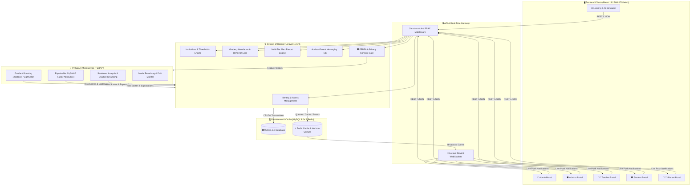
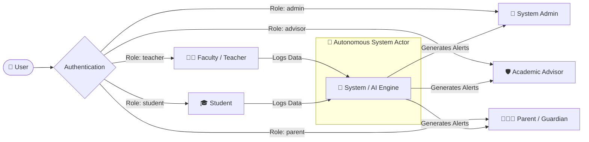
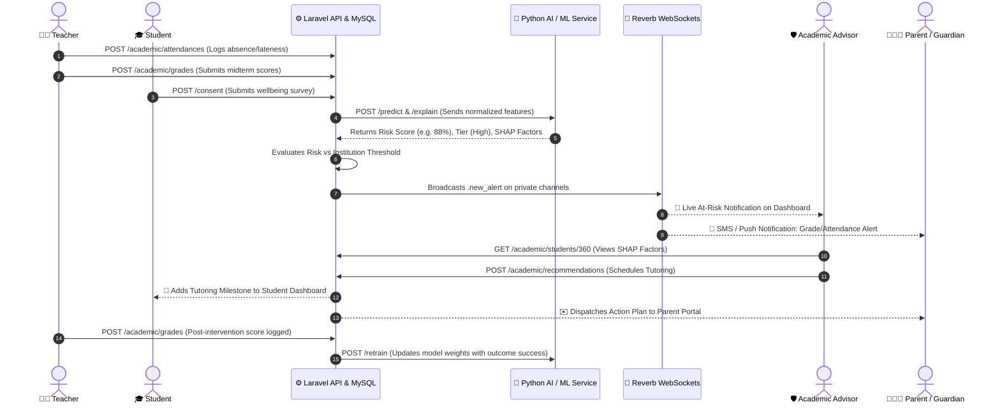

# Comprehensive System User Manual
## Smart Platform for Student Behavior Analysis & Academic Dropout Prediction (SBA Platform)

---

## 1. System Overview & Architecture

The **Student Behavior Analysis (SBA) Platform** is an enterprise-grade, AI-driven educational intelligence system designed for schools and universities. It identifies early indicators of academic struggling, absenteeism, and behavioral drift to empower educators and families with timely, explainable interventions before a student drops out.

### 🏛️ Complete System Architecture Flowchart

---

## 2. Actor-by-Actor User Manual

The system supports **six distinct actors**: five human user roles and one autonomous AI actor.

---

### 👑 1. System Administrator (`admin`)

The System Administrator oversees multi-institutional operations, user provisioning, global risk thresholds, security policies, and system reliability.

#### Key Features & How to Use Them:
1. **System Overview Dashboard (`/admin`)**:
   - **Cross-Campus KPIs**: View real-time aggregated metrics for Total Students, System Attendance, Monitored Cohorts, and Active Curricula.
   - **System Trends**: Interactive Recharts area curves showing attendance trajectory and subject-level vulnerability distributions.
2. **User Accounts & Permissions (`/admin/users` / `/admin/accounts`)**:
   - **Provisioning**: Create, edit, and deactivate user accounts for faculty, advisors, students, and parents.
   - **Role Assignment**: Assign role permissions (Spatie RBAC) and link users to their respective educational institutions.
3. **Institution Management (`/admin/institutions`)**:
   - **Operational Modes**: Switch institutions between **School Mode** (Grades → Classes → Sections) and **University Mode** (Colleges → Departments → Programs).
   - **Risk Threshold Sliders**: Adjust the percentage threshold (e.g., 75%, 80%) that triggers automated multi-tier alert fanouts.
4. **Audit Logs & Compliance (`/admin/audit-logs`)**:
   - **FERPA Compliance Tracking**: Searchable audit logs capturing every user query, record export, and configuration change.

---

### 🛡️ 2. Academic Advisor / Counselor (`advisor`)

Academic Advisors serve as the primary coordinators of student success, monitoring at-risk rosters and dispatching targeted interventions.

#### Key Features & How to Use Them:
1. **At-Risk Student Roster (`/advisor`)**:
   - **Priority Triage**: Sort and filter students based on automated **AI Risk Scores (0–100%)** and Severity Tiers (**Critical, High, Medium, Low**).
   - **Vulnerability Tags**: Instantly see trigger flags such as *Attendance Drop*, *Midterm Dip*, or *Behavioral Notice*.
2. **Student 360-Degree Profile (`/advisor/student/:id`)**:
   - **SHAP Explainability Factors**: View the exact mathematical weight of each contributing factor (e.g., `+34% Absence`, `+22% Exam 1 Failure`).
   - **Historical Trajectory**: Review GPA history, past teacher logs, and previous counseling notes.
3. **Intervention Scheduling & Management**:
   - **Schedule Intervention**: Create structured support actions (e.g., 1-on-1 Tutoring, Well-Being Check-in, Parent Conference).
   - **Outcome Logging**: Record whether student metrics improved after the intervention to help retrain the AI models.
4. **Direct Communication Hub (`/advisor/communications`)**:
   - Message parents and teachers securely with full audit history.

---

### 👨‍🏫 3. Faculty / Teacher (`teacher`)

Teachers manage classroom learning, record formative assessments, log daily attendance, and flag early behavioral concerns.

#### Key Features & How to Use Them:
1. **Classroom Performance Hub (`/teacher`)**:
   - **Course Switcher**: Switch between assigned sections and classes with instant aggregate performance insights.
   - **Weekly Performance vs Attendance Dual Chart**: Compare weekly score trends directly against class attendance rates.
2. **Attendance Logging (`/teacher/attendance`)**:
   - **Daily Check-In**: Record Present, Absent, Late, or Excused statuses in a few clicks.
3. **Grade & Evaluation Entry (`/teacher/grades`)**:
   - **Assessment Scores**: Input quiz, homework, and exam marks. Data instantly feeds into the AI feature pipeline.
4. **Behavioral Incident Reports (`/teacher/incidents`)**:
   - **Early Flagging**: Report behavioral, engagement, or academic concerns directly to the assigned advisor.
5. **Classroom Report Exports**:
   - Export official course transcripts as PDF or Excel spreadsheets.

---

### 🎓 4. Student (`student`)

Students have transparency into their academic progress, upcoming deadlines, AI-driven study recommendations, and well-being resources.

#### Key Features & How to Use Them:
1. **Personal Academic Dashboard (`/student`)**:
   - **GPA Trajectory & Goal Setting**: View historical GPA curves against semester milestone targets.
   - **Attendance Health Ring**: Monitor personal attendance percentage against the required institutional threshold (e.g., 90%).
2. **Actionable Alerts & Tasks (`/student/alerts`)**:
   - **Requirement Cards**: View upcoming midterms, scheduled counseling appointments, and remediation tasks.
3. **Academics & Course Registration (`/student/academics` / `/student/registration`)**:
   - **Self-Service Registration**: Browse available courses and review graduation roadmap progress.
4. **Well-Being Surveys (`/student/settings`)**:
   - Complete periodic sentiment surveys processed by the NLP engine to highlight stress or burnout.
5. **AI Academic Chatbot**:
   - Ask questions about study habits, course policies, or tutoring availability.

---

### 👨‍👩‍👧 5. Parent / Guardian (`parent`)

Parents stay informed regarding their children's progress, attendance notices, official transcripts, and advisor communication.

#### Key Features & How to Use Them:
1. **Multi-Child Switcher (`/parent`)**:
   - Seamlessly toggle between multiple enrolled dependents from a single unified portal.
2. **Real-Time Notification Timeline**:
   - Receive immediate push and in-app alerts when a child misses a session or experiences a significant grade drop.
3. **Official Periodic Reports**:
   - Download certified monthly summaries and mid-term academic progress reports in PDF format.
4. **Advisor Direct Messaging (`/parent/communications`)**:
   - Send secure notes to the student's assigned academic advisor.
5. **Consent & Privacy Settings (`/parent/settings`)**:
   - Manage explicit parental consents for AI behavioral analysis and notification channel preferences (SMS, Email, Push).

---

### 🤖 6. Autonomous System / AI Engine (Backend Microservice)

The AI Engine operates continuously in the background to analyze ingested data and deliver predictive intelligence.

#### Capabilities:
1. **Risk Scoring (XGBoost / LightGBM)**: Classifies students into risk cohorts by analyzing attendance, grades, LMS activity, and historical trends.
2. **Explainable AI (SHAP Engine)**: Calculates exact mathematical factor contributions so advisors understand *why* a student is at risk.
3. **Natural Language Processing (NLP)**: Evaluates student survey sentiment and powers context-grounded chatbot responses.
4. **Automated Drift & Retraining Pipeline**: Continuously refines model accuracy based on intervention outcome logs.

---

## 3. End-to-End System Workflow Flowchart

The diagram below illustrates how data moves through the entire system from daily entry to AI prediction and intervention execution.

---

## 4. Quick Reference: System Navigation & Endpoints

| Portal | Primary URL | Main Views & Features |
|---|---|---|
| **Public** | `/` | Landing Page, Interactive AI Simulator, Demo Request, Features |
| **Auth** | `/login` | Secure Sanctum Login, Role Redirection, Session Management |
| **Admin** | `/admin` | Overview, Accounts & Permissions (`/admin/accounts`), Institutions (`/admin/institutions`), Settings (`/admin/settings`) |
| **Advisor** | `/advisor` | At-Risk Roster, Early-Alert Inbox (`/advisor/inbox`), Comms Hub (`/advisor/communications`), Student 360 View (`/advisor/student`) |
| **Teacher** | `/teacher` | Classroom Dashboard, Grades (`/teacher/grades`), Attendance (`/teacher/attendance`), Incidents (`/teacher/incidents`), AI Hub (`/teacher/feedback`) |
| **Student** | `/student` | Dashboard, Alerts (`/student/alerts`), Academics (`/student/academics`), Registration (`/student/registration`), Settings (`/student/settings`) |
| **Parent** | `/parent` | Family Dashboard, Child Switcher, Communications (`/parent/communications`), Settings & Consents (`/parent/settings`) |

---

## 5. Security & Privacy Guarantees

- **Authentication**: Stateful cookie tokens or Bearer JWT tokens via Laravel Sanctum.
- **Authorization**: Role-Based Access Control (RBAC) enforced at both route guard and API middleware layers.
- **Data Privacy**: FERPA-compliant privacy protections, audit trail logging, and explicit consent gates for AI analytics.
- **Internationalization**: Full bilingual English and Arabic support with automatic RTL layout and **Cairo** typography.
