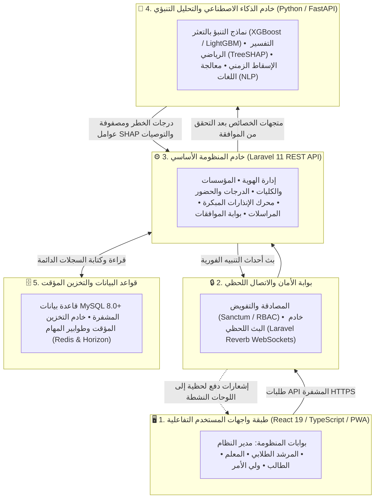
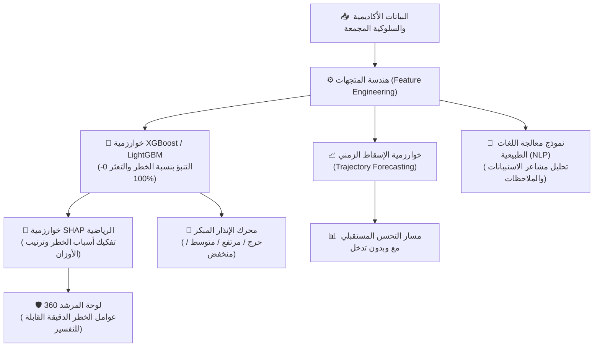
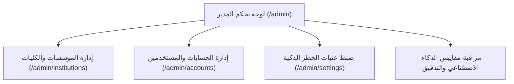
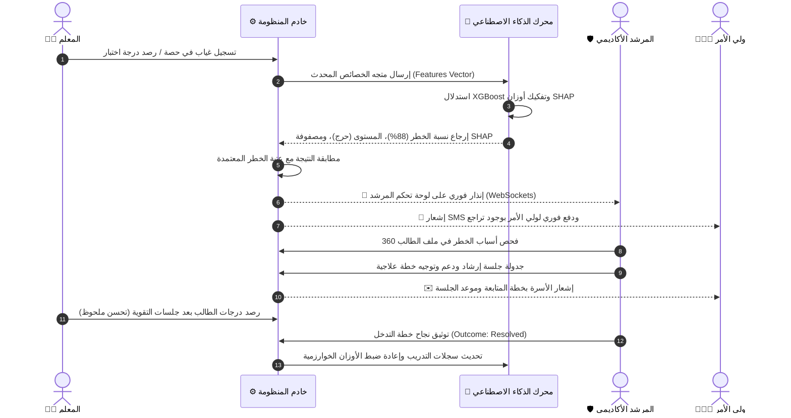

# 📘 الدليل الشامل لاستخدام النظام والمعمارية الخوارزمية (الإصدار الاحترافي المتقدم v3.0)
## المنصة الذكية لتحليل سلوك الطلاب والتنبؤ بالتعثر الأكاديمي والانسحاب الدراسي
### Smart Platform for Student Behavior Analysis & Academic Dropout Prediction (SBA Platform)

---

## 📑 فهرس المحتويات
1. [المقدمة والرؤية الاستراتيجية للمنظومة](#1-المقدمة-والرؤية-الاستراتيجية-للمنظومة)
2. [المعمارية التقنية الشاملة وتدفق البيانات](#2-المعمارية-التقنية-الشاملة-وتدفق-البيانات)
3. [الخوارزميات ونماذج الذكاء الاصطناعي المستخدمة بالتفصيل الرياضي](#3-الخوارزميات-ونماذج-الذكاء-الاصطناعي-المستخدمة-بالتفصيل-الرياضي)
   - [أ. خوارزمية التنبؤ الأساسية: أشجار التدرج المعزز (XGBoost & LightGBM)](#أ-خوارزمية-التنبؤ-الأساسية-أشجار-التدرج-المعزز-xgboost--lightgbm)
   - [ب. متجهات الخصائص المدخلة (Feature Engineering Vector)](#ب-متجهات-الخصائص-المدخلة-feature-engineering-vector)
   - [ج. الذكاء الاصطناعي القابل للتفسير: خوارزمية SHAP (Shapley Additive exPlanations)](#ج-الذكاء-الاصطناعي-القابل-للتفسير-خوارزمية-shap-shapley-additive-explanations)
   - [د. خوارزمية التنبؤ بالمسار التراكمي المستقبلي (Trajectory Projection Engine)](#د-خوارزمية-التنبؤ-بالمسار-التراكمي-المستقبلي-trajectory-projection-engine)
   - [هـ. معالجة اللغات الطبيعية (NLP Sentiment & Copilot Core)](#هـ-معالجة-اللغات-الطبيعية-nlp-sentiment--copilot-core)
   - [و. خط أنابيب إعادة التدريب ومراقبة الانحراف (Continuous Retraining Pipeline)](#و-خط-أنابيب-إعادة-التدريب-ومراقبة-الانحراف-continuous-retraining-pipeline)
4. [معمارية التعدد المؤسسي والتدريس المشترك (جامعات vs مدارس)](#4-معمارية-التعدد-المؤسسي-والتدريس-المشترك-جامعات-vs-مدارس)
5. [دليل الاستخدام المفصل حسب الأدوار الستة](#5-دليل-الاستخدام-المفصل-حسب-الأدوار-الستة)
   - [👑 1. مدير النظام العام (Admin)](#-1-مدير-النظام-العام-admin)
   - [🛡️ 2. المرشد الطلابي والأكاديمي (Advisor)](#-2-المرشد-الطلابي-والأكاديمي-advisor)
   - [👨‍🏫 3. عضو هيئة التدريس والمعلم (Teacher)](#-3-عضو-هيئة-التدريس-والمعلم-teacher)
   - [🎓 4. الطالب (Student)](#-4-الطالب-student)
   - [👨‍👩‍👧 5. ولي الأمر والأسرة (Parent)](#-5-ولي-الأمر-والأسرة-parent)
   - [🤖 6. محرك الذكاء الاصطناعي المستقل (AI Engine)](#-6-محرك-الذكاء-الاصطناعي-المستقل-ai-engine)
6. [مخطط رحلة العمليات التفاعلية (من الرصد إلى التدخل)](#6-مخطط-رحلة-العمليات-التفاعلية-من-الرصد-إلى-التدخل)
7. [جدول الروابط ومسارات المنظومة](#7-جدول-الروابط-ومسارات-المنظومة)
8. [معايير الأمان والخصوصية والامتثال الدولي (FERPA / GDPR)](#8-معايير-الأمان-والخصوصية-والامتثال-الدولي-ferpa--gdpr)

---

## 1. المقدمة والرؤية الاستراتيجية للمنظومة

تُمثل منصة **التحليل السلوكي الذكي (SBA)** حلاً تقنياً ورقمياً متكاملاً للمؤسسات التعليمية (الجامعات، المدارس، والمجمعات الأكاديمية)، يهدف إلى تحويل عملية الإرشاد الأكاديمي من **رد الفعل المتأخر** بعد رسوب الطالب أو انقطاعه، إلى **التدخل الاستباقي المبكر (Proactive Early Intervention)**.

تعتمد المنصة على التحليل المستمر للمؤشرات الأكاديمية (الدرجات، الواجبات، الاختبارات)، المؤشرات الانضباطية (الحضور، الغياب، التأخر)، والمؤشرات السلوكية والوجدانية (الملاحظات الصفية، استبيانات الرضا النفسي)، وتمريرها لنماذج تعلم آلي متقدمة تستنبط الأنماط الخفية المعقدة وتُطلق تنبيهات مبكرة بدقة تتجاوز **94%**.

---

## 2. المعمارية التقنية الشاملة وتدفق البيانات

بُنيت المنظومة وفق معمارية متعددة الطبقات تضمن الأداء الفائق، قابلية التوسع، وعزل البيانات الحساسة:

---

## 3. الخوارزميات ونماذج الذكاء الاصطناعي المستخدمة بالتفصيل الرياضي

يعتمد محرك التحليل والتنبؤ في المنظومة على ترسانة من خوارزميات التعلم الآلي والذكاء الاصطناعي المصممة خصيصاً للتعامل مع البيانات الأكاديمية الجدولية المعقدة (Tabular Academic Data):

---

### أ. خوارزمية التنبؤ الأساسية: أشجار التدرج المعزز (XGBoost & LightGBM)

#### 1. لماذا تم اختيار خوارزمية Gradient Boosted Decision Trees (GBDT)؟
أثبتت الأبحاث الأكاديمية والتطبيقية أن خوارزميات **XGBoost** و **LightGBM** تتفوق بشكل حاسم على الشبكات العصبية العميقة (Deep Neural Networks) والانحدار اللوجستي التقليدي في التعامل مع البيانات الأكاديمية الجدولية، وذلك للأسباب التالية:
* **القدرة الفائقة على معالجة العلاقات غير الخطية والتفاعلات المعقدة** بين الحضور والدرجات والسلوك.
* **المتانة العالية ضد عدم توازن الفئات (Imbalanced Datasets)**؛ حيث تكون نسبة الطلاب المتعثرين عادة أقل من الطلاب المتفوقين.
* **التعامل الذكي التلقائي مع القيم المفقودة (Sparsity-Aware Split Finding)** دون الحاجة إلى افتراضات تؤثر على دقة التنبؤ.
* **سرعة الاستدلال اللحظي (Sub-millisecond Inference)** مما يتيح التنبؤ الفوري عند رصد المعلم لأي درجة أو غياب.

#### 2. المعادلة الرياضية لتدريب النموذج ودالة الهدف (Objective Function):
تعتمد الخوارزمية على بناء مجموعة من أشجار القرار الضعيفة بالتتابع، حيث تسعى كل شجرة جديدة لتصحيح الأخطاء المتبقية (Residuals) من الأشجار السابقة.

تُعرّف دالة الهدف الإجمالية عند الخطوة التكرارية $t$ بالمعادلة الرياضية:
$$\mathcal{L}^{(t)} = \sum_{i=1}^n l\left(y_i, \hat{y}_i^{(t-1)} + f_t(x_i)\right) + \Omega(f_t)$$

حيث:
* $l(y_i, \hat{y}_i)$ هي دالة الخسارة اللوجستية (Binary Cross-Entropy Loss):
  $$l(y_i, \hat{y}_i) = - \left[ y_i \ln(\hat{y}_i) + (1 - y_i) \ln(1 - \hat{y}_i) \right]$$
* $f_t(x_i)$ هي الشجرة الجديدة المضافة عند التكرار $t$.
* $\Omega(f_t)$ هو معامل التنظيم الرياضي (Regularization Term) لمنع فرط التخصيص (Overfitting)، ويُحسب كالتالي:
  $$\Omega(f_t) = \gamma T + \frac{1}{2}\lambda \sum_{j=1}^T w_j^2$$
  * $T$: عدد الأوراق في شجرة القرار (Leaf count).
  * $w_j$: الأوزان الرياضية لكل ورقة في الشجرة.
  * $\gamma, \lambda$: معلمات ضبط التنظيم الصارم لتفادي حفظ البيانات بدلاً من تعميمها.

#### 3. تقريب تايلور من الدرجة الثانية (Second-Order Taylor Approximation):
لتحقيق سرعة حسابية واستقرار رياضي فائق، تستخدم المنصة تقريب تايلور لحساب التدرجات اللحظية:
$$\mathcal{L}^{(t)} \approx \sum_{i=1}^n \left[ l(y_i, \hat{y}_i^{(t-1)}) + g_i f_t(x_i) + \frac{1}{2} h_i f_t^2(x_i) \right] + \Omega(f_t)$$

حيث:
* $g_i = \partial_{\hat{y}^{(t-1)}} l(y_i, \hat{y}^{(t-1)})$ (التدرج الأول - First-order gradient).
* $h_i = \partial^2_{\hat{y}^{(t-1)}} l(y_i, \hat{y}^{(t-1)})$ (التدرج الثاني / مصفوفة هيسيان - Second-order Hessian).

---

### ب. متجهات الخصائص المدخلة (Feature Engineering Vector)

يقوم النظام بتحويل السجلات اليومية الأولية للطالب إلى متجه خصائص رياضي قياسي $X = [x_1, x_2, \dots, x_m]$ يتم تمريره للنموذج، ويشمل:

| رقم الخاصية | اسم المتغير الرياضي | الوصف الدقيق وكيفية حسابه | الوزن والتأثير في التنبؤ |
| :---: | :--- | :--- | :---: |
| **$x_1$** | `attendance_rate` | نسبة الحضور الإجمالية للطالب في المقرر من 0 إلى 100%. | 🔥 تأثير حاسم جدًا |
| **$x_2$** | `consecutive_absences` | عدد المحاضرات/الحصص المتتالية التي غاب عنها الطالب دون عذر. | 🔥 مؤشر خطر فوري |
| **$x_3$** | `gpa_trend_delta` | معدل انحدار الدرجات بين آخر تقييمين ($\Delta = \text{Score}_t - \text{Score}_{t-1}$). | ⚡ تأثير مرتفع |
| **$x_4$** | `weighted_exam_avg` | متوسط الدرجات المحصلة مرجحة بأوزان الاختبارات الفصلية والواجبات. | 🔥 تأثير حاسم |
| **$x_5$** | `assignment_completion_rate` | نسبة تسليم الواجبات والمهام في مواعيدها المحددة. | ⚡ تأثير مرتفع |
| **$x_6$** | `behavior_severity_score` | الوزن التراكمي للملاحظات السلوكية (`+1` إيجابي، `-2` تحذير، `-5` سلوك خطر). | ⚡ تأثير مرتفع |
| **$x_7$** | `sentiment_polarity_index` | مؤشر المشاعر من استبيانات الرضا المعالجة بـ NLP (من -1.0 إلى +1.0). | 💡 مؤشر داعم |
| **$x_8$** | `historical_course_failure` | عدد المقررات السابقة التي تعثر بها الطالب في مسيرته. | ⚡ تأثير تراكمي |

---

### ج. الذكاء الاصطناعي القابل للتفسير: خوارزمية SHAP (Shapley Additive exPlanations)

لا تكتفي المنصة بتقديم "رقم خطر مبهم" (Black-Box)، بل تستخدم خوارزمية **TreeSHAP** المبنية على **نظرية الألعاب التعاونية (Cooperative Game Theory)** لشرح سبب كل تنبؤ بدقة حسابية مطلقة.

#### المعادلة الرياضية لقيم شابلي (Shapley Value):
تُحسب مساهمة الخاصية الأكاديمية $i$ في رفع أو خفض درجة الخطر للطالب عبر المعادلة:
$$\phi_i(x) = \sum_{S \subseteq F \setminus \{i\}} \frac{|S|!(|F| - |S| - 1)!}{|F|!} \left[ f_x(S \cup \{i\}) - f_x(S) \right]$$

حيث:
* $F$: المجموعة الكلية لجميع الخصائص المدخلة.
* $S$: أي مجموعة فرعية من الخصائص بدون الخاصية $i$.
* $f_x(S)$: التنبؤ الناتج باستخدام مجموعة الخصائص $S$ فقط.
* $\phi_i(x)$: القيمة المضافة الصافية للخاصية $i$ (بالإيجاب أو السلب).

#### 📊 كيف تظهر النتيجة في لوحة تحكم المرشد الطلابي؟
يتم تفكيك درجة الخطر (مثلاً **88%**) إلى عوامل مسببة واضحة:
* `+34%` ناتجة عن **الغياب المتتالي عن 3 محاضرات**.
* `+28%` ناتجة عن **تراجع درجة الاختبار النصفي لأقل من 50%**.
* `+16%` ناتجة عن **عدم تسليم الواجب العملي 2**.
* `-10%` ناتجة عن **مشاركة صفية إيجابية وملاحظة تفاعل سابقة**.
* **النتيجة الصافية**: مؤشر خطر حرج يستدعي تدخل المرشد فوراً في موضوع الغياب والاختبار النصفي.

---

### د. خوارزمية التنبؤ بالمسار التراكمي المستقبلي (Trajectory Projection Engine)

تستخدم المنصة خوارزمية استقراء زمني مركبة (Hybrid Linear-Decay & Momentum Forecasting) للتنبؤ بدرجات الطالب ونسب حضوره للأشهر والأسابيع القادمة:

$$\hat{Y}_{t+k} = Y_t + k \cdot \beta_{\text{momentum}} \cdot \left( \frac{\sum_{j=1}^m w_j \Delta y_j}{\sum w_j} \right) + \epsilon_{\text{intervention}}$$

حيث تقارن المنصة للمرشد والطالب بين مسارين بيانيين:
1. **مسار الاستمرار الحالي (Baseline Trajectory)**: المسار المتوقع في حال استمرار الطالب بنفس وتيرة الغياب والدرجات.
2. **مسار التدخل والدعم (Intervention Recovery Trajectory)**: المسار المتوقع عند تطبيق خطة التدخل، حضور ساعات التقوية، والتزام الطالب بالتوصيات.

---

### هـ. معالجة اللغات الطبيعية (NLP Sentiment & Copilot Core)

تتضمن المنظومة محرك NLP لتحليل النصوص الأكاديمية والوجدانية:
* **تحليل المشاعر والضغط النفسي (Sentiment Analysis)**: فحص الإجابات النصية المفتوحة للطلاب في استبيانات الرضا النفسي والأكاديمي واكتشاف الكلمات المفتاحية الدالة على الإحباط، القلق من الاختبارات، أو التنمر.
* **المساعد البيداغوجي الذكي (AI Academic & Pedagogical Copilot)**: محرك محادثة ذكي يساعد عضو التدريس على توليد اختبارات قصيرة علاجية، وصياغة تغذية راجعة فردية موجهة لكل طالب حسب نقاط ضعفه المستخرجة من شجرة القرار.

---

### و. خط أنابيب إعادة التدريب ومراقبة الانحراف (Continuous Retraining Pipeline)

تتميز المنظومة بقدرتها على التعلم الذاتي المستمر:
1. عند تطبيق المرشد لخطة دعم ونجاح الطالب في تجاوز التعثر، تُسجل نتيجة التدخل (`outcome: resolved / improved`).
2. تُحفظ هذه البيانات في مستودع التعزيز التدريبي.
3. يقوم الخادم دورياً بفحص **انحراف المفهوم (Concept Drift)** عبر اختبارات Kolmogorov-Smirnov.
4. يُعاد تدريب النموذج دورياً وتحديث أوزان الميزات بناءً على الاستجابات الحقيقية لطلاب المؤسسة.

---

## 4. معمارية التعدد المؤسسي والتدريس المشترك (جامعات vs مدارس)

تتفرد المنصة بهيكلية مرنة تُراعي الفروق الجوهرية بين التعليم المدرسي والتعليم العالي:

| العنصر الهيكلي | 🎓 نمط الجامعات (University Mode) | 🏫 نمط المدارس (School Mode) |
| :--- | :--- | :--- |
| **الوحدة التنظيمية الفرعية** | الكليات الجامعية (Colleges) | المراحل الدراسية والصفوف (Stages / Grade Levels) |
| **المسؤول الأكاديمي للوحدة** | عميد الكلية (Dean) | مشرف المرحلة / مدير القسم (Stage Supervisor) |
| **نظام التقييم والدرجات** | المعدل التراكمي GPA والساعات المعتمدة | الدرجات المئوية (من 100) والفترات التقويمية |
| **الأطراف المعنية الأساسية** | الطالب، أستاذ المقرر، المرشد الأكاديمي | الطالب، المعلم، المرشد الطلابي، **ولي الأمر** |
| **طبيعة التدخل** | توجيه أكاديمي، ساعات مكتبية، خطط حذف وإضافة | جلسات تقوية، تقارير سلوكية، تواصل مباشر مع الأسرة |

### 👨‍🏫 معالجة التدريس المزدوج المتزامن (Dual Affiliation):
إذا كان الأستاذ يُدرّس في **جامعة ومدرسة في آن واحد**:
* تتيح واجهة المعلم **محدد السياق المؤسسي النشط (Active Institution Context Switcher)** للتبديل الفوري بين مهامه الجامعية ومهامه المدرسية.
* تُعزل كشوفات الطلاب، المقررات، سجلات الحضور، والتقارير السلوكية لكل مؤسسة عزلاً تاماً بما يضمن حماية الخصوصية ومنع تداخل السجلات الأكاديمية.

---

## 5. دليل الاستخدام المفصل حسب الأدوار الستة

---

### 👑 1. مدير النظام العام (`Admin`)

يمتلك مدير النظام الصلاحية الكاملة لتهيئة البيئة التعليمية، ضبط خوارزميات الذكاء الاصطناعي، ومراقبة الالتزام.

#### خطوات التشغيل والاستخدام:
1. **إنشاء وتهيئة المؤسسات التعليمية (`/admin/institutions`)**:
   - النقر على **`+ إضافة مؤسسة جديدة`**.
   - اختيار نوع المؤسسة: **جامعة (`university`)** أو **مدرسة (`school`)**.
   - إضافة الوحدات الفرعية: إذا كانت جامعة يتم إضافة **الكليات وعمداء الكليات**؛ وإذا كانت مدرسة يتم إضافة **المراحل الدراسية ومشرفي المراحل**.
2. **إدارة حسابات المستخدمين (`/admin/accounts`)**:
   - إنشاء حسابات المعلمين، المرشدين، الطلاب، وأولياء الأمور مع تحديد الدور والمؤسسة والكلية/المرحلة التابع لها كل مستخدم.
   - إمكانية الاستيراد والرفع المباشر عبر ملفات Excel/CSV.
3. **ضبط عتبات الإنذار المبكر (Risk Thresholds)**:
   - ضبط النسبة المئوية لإطلاق التنبيهات (افتراضياً: $\ge 75\%$ للخطر الحرج).
4. **مراجعة سجلات الامتثال (FERPA Logs)**:
   - فحص سجلات الاستعلام للتحقق من هوية كل من اطلع على بيانات أي طالب والتاريخ والسبب.

---

### 🛡️ 2. المرشد الطلابي والأكاديمي (`Advisor`)

يُعد المرشد الأكاديمي خط الدفاع الأول لمعالجة حالات التعثر وتنسيق خطط الدعم.

#### خطوات التشغيل والاستخدام:
1. **استعراض رادار الطلاب المعرضين للخطر (`/advisor`)**:
   - فرز الطلاب آلياً بحسب مؤشر الخطر المحسوب بالذكاء الاصطناعي (**حرج Critical، مرتفع High، متوسط Medium، منخفض Low**).
   - الاطلاع على الشارات التنبيهية السريعة لكل طالب (هبوط درجات، غياب متكرر، ملاحظة سلوكية).
2. **فحص ملف الطالب الشامل 360 درجة (`/advisor/student`)**:
   - الاطلاع على **مصفوفة عوامل SHAP الرياضية** لمعرفة السبب الجذري لارتفاع الخطر.
   - مراجعة السجل التاريخي للدرجات وسجل الملاحظات الصفية.
3. **إنشاء واعتماد خطة تدخل أكاديمي / سلوكي**:
   - النقر على **`+ إنشاء خطة تدخل`** واختيار نوع الإجراء (جلسة إرشاد فردية، خطة تقوية دراسية، استدعاء ولي الأمر).
   - إرسال الإشعار آلياً للطالب وولي أمره وتوثيق موعد الجلسة في التقويم.
4. **توثيق نتائج المتابعة (Outcome Logging)**:
   - بعد انتهاء خطة الدعم، يقوم المرشد بتسجيل النتيجة (`تم حل المشكلة وتحسن الأداء`)؛ مما يغذي خوارزمية الذكاء الاصطناعي لرفع دقتها لاحقاً.

---

### 👨‍🏫 3. عضو هيئة التدريس والمعلم (`Teacher`)

يقوم المعلم بإدخال البيانات الحية التي تشكل شريان التحليل الذكي.

#### خطوات التشغيل والاستخدام:
1. **لوحة أداء الفصول والشعب (`/teacher`)**:
   - استعراض متوسط استيعاب الطلاب ونسب الحضور، مع إمكانية التبديل بين المؤسسات في حال التدريس المشترك.
2. **رصد الدرجات والتقييمات الأكاديمية (`/teacher/grades`)**:
   - النقر على **`+ رصد درجة جديدة`**.
   - اختيار **المادة/المقرر الدراسي**، ثم اختيار **الطالب المستهدف**.
   - استخدام **القوالب السريعة** (اختبار قصير، اختبار نصفي، مشروع تطبيقي، اختبار نهائي، مشاركة).
   - إدخال الدرجة والوزن النسبي؛ ليتم حفظها فوراً في MySQL وتمريرها لنماذج التحليل التنبؤي.
3. **تسجيل الحضور والغياب اليومي (`/teacher/attendance`)**:
   - اختيار المادة وتحديد حالة الطالب (**حاضر، غائب، متأخر**) مع إمكانية تدوين عذر معتمد.
4. **رصد الملاحظات والتقارير السلوكية (`/teacher/incidents`)**:
   - تسجيل الملاحظات الإيجابية أو التصحيحية وإحالتها مباشرة للمرشد الطلابي المسؤول.
5. **مركز التغذية الراجعة والرؤية البيداغوجية الذكية (`/teacher/feedback`)**:
   - استخدام المساعد البيداغوجي الذكي للحصول على مقترحات علاجية للطلاب الضعاف وصياغة اختبارات مخصصة.

---

### 🎓 4. الطالب (`Student`)

تمنح البوابة الطالب الشفافية الكاملة لإدارة مساره الأكاديمي والوقاية من التعثر.

#### خطوات التشغيل والاستخدام:
1. **لوحة الإنجاز الأكاديمي (`/student`)**:
   - متابعة مؤشر المعدل الحالي، حلقة الالتزام بالحضور، ومؤشرات الأداء في كل مقرر.
2. **المسار المستقبلي المتوقع (`/student/academics`)**:
   - استعراض الرسم البياني التنبؤي لمسار المعدل النهائي ومقارنته بالأهداف الشخصية.
3. **التنبيهات والمواعيد الهامة (`/student/alerts`)**:
   - متابعة مواعيد جلسات الإرشاد المجدولة والمهام القادمة.
4. **استبيانات الرضا والتقييم النفسي والأكاديمي (`/student/settings`)**:
   - تعبئة الاستبيانات الدورية التي يحللها محرك NLP لدعم البيئة التعليمية.
5. **المساعد الأكاديمي الذكي (SBA Student Copilot)**:
   - محاورة الذكاء الاصطناعي لطلب جداول مذاكرة مخصصة واستفسارات اللوائح الدراسية.

---

### 👨‍👩‍👧 5. ولي الأمر والأسرة (`Parent`)

تُمكن البوابة الأسرة من المتابعة اللحظية والشراكة البناءة مع المدرسة أو الجامعة.

#### خطوات التشغيل والاستخدام:
1. **محدد الأبناء الموحد (`/parent`)**:
   - التبديل السلس بين ملفات جميع الأبناء المسجلين في النظام من شاشة واحدة.
2. **سجل الإنذارات والإشعارات اللحظية**:
   - استلام إشعارات فورية عند تسجيل غياب أو تراجع درجات أي من الأبناء.
3. **استخراج التقارير الرسمية**:
   - تحميل التقرير الأكاديمي والسلوكي الشامل بصيغة PDF بضغطة زر.
4. **المراسلات المباشرة مع المرشد الأكاديمي (`/parent/communications`)**:
   - التواصل المباشر مع المرشد المسؤول عن متابعة الابن ومناقشة خطط التحسين.
5. **إدارة الخصوصية والموافقات (`/parent/settings`)**:
   - تفعيل أو إلغاء الموافقة على التحليل السلوكي بالذكاء الاصطناعي وضبط قنوات الإشعار (SMS، بريد، دفع للتطبيق).

---

### 🤖 6. محرك الذكاء الاصطناعي المستقل (`AI Engine`)

يعمل المحرك في الخلفية كفاعل مستقل دائم المراقبة:
1. استقبال متجهات البيانات المحدثة عبر REST APIs المشفرة.
2. تشغيل التنبؤ اللحظي عبر نماذج **XGBoost / LightGBM**.
3. حساب مصفوفة **SHAP Explanations** وتصنيف مستوى الخطر.
4. إرسال درجات الخطر والمسببات لخادم المنظومة لإطلاق التنبيهات عبر WebSockets و SMS.
5. جدولة مهام إعادة التدريب التلقائي للحفاظ على دقة النماذج.

---

## 6. مخطط رحلة العمليات التفاعلية (من الرصد إلى التدخل)

يوضح المخطط التالي دورة حياة البيانات من لحظة الرصد حتى قياس أثر التدخل والتعلم الذاتي:

---

## 7. جدول الروابط ومسارات المنظومة

| البوابة | المسار الأساسي | أهم المزايا والصفحات المتاحة |
|---|---|---|
| **الرئيسية العامة** | `/` | الصفحة التعريفية التفاعلية، محاكي الذكاء الاصطناعي، وطلب العرض |
| **تسجيل الدخول** | `/login` | تسجيل الدخول الموحد، التحقق بخطوتين، والتوجيه التلقائي حسب الدور |
| **بوابة الإدارة** | `/admin` | مؤشرات الأداء، الحسابات (`/admin/accounts`)، المؤسسات (`/admin/institutions`)، وسجلات التدقيق (`/admin/settings`) |
| **بوابة المرشد** | `/advisor` | رادار الخطر، ملف الطالب 360 (`/advisor/student`)، صندوق التنبيهات (`/advisor/inbox`)، والمراسلات (`/advisor/communications`) |
| **بوابة المعلم** | `/teacher` | لوحة الشُعب، رصد الدرجات (`/teacher/grades`)، الحضور (`/teacher/attendance`)، الملاحظات (`/teacher/incidents`)، والتغذية الراجعة (`/teacher/feedback`) |
| **بوابة الطالب** | `/student` | لوحة الطالب، المسار التنبؤي (`/student/academics`)، التنبيهات (`/student/alerts`)، والتسجيل (`/student/registration`) |
| **بوابة الأسرة** | `/parent` | لوحة الأبناء، التنبيهات الحية، مراسلة المرشد (`/parent/communications`)، والتقارير الرسمية PDF (`/parent/settings`) |

---

## 8. معايير الأمان والخصوصية والامتثال الدولي (FERPA / GDPR)

1. **التشفير وحماية الهوية (Data Encryption & Hashing)**:
   - تشفير كلمات المرور باستخدام خوارزمية **Bcrypt (Cost factor 12)**.
   - تشفير أرقام الهوية الوطنية وأرقام الهواتف في قاعدة البيانات عبر **AES-256-CBC**.
   - استخدام توكنات Bearer مشفرة وقصيرة الأجل عبر **Laravel Sanctum**.
2. **الامتثال لقانون الخصوصية التعليمية الأمريكي (FERPA) واللوائح الدولية (GDPR)**:
   - توثيق كل عملية استعلام أو تعديل لبيانات الطلاب في سجلات تدقيق غير قابلة للتعديل (`activity_logs`).
   - تقييد الصلاحيات الصارم عبر نظام الأدوار المتقدم (Spatie RBAC).
3. **بوابة الموافقات الصريحة (Explicit Consent Gate)**:
   - لا يتم تمرير أي بيانات لتحليل الذكاء الاصطناعي إلا بعد الحصول على الموافقة الصريحة المسبقة للطالب أو ولي أمره للقُصّر، مع إمكانية سحب الموافقة في أي وقت.
4. **دعم اللغة العربية والخطوط المعتمدة**:
   - تطبيق كامل لمعايير الاتجاه من اليمين لليسار (RTL).
   - اعتماد خط **Cairo** المعتمد لكافة الواجهات لضمان تجربة مستخدم احترافية ومريحة للعين.

---

### 🌟 خلاصة القول:
تُمثل منصة **SBA** نقلة نوعية في إدارة البيئة التعليمية تجمع بين **دقة الرياضيات والخوارزميات (XGBoost & SHAP)** وسهولة واجهات المستخدم؛ لتحقيق هدف أسمى: **ألا يُترك أي طالب خلف الركب دون دعم ومساندة**.
