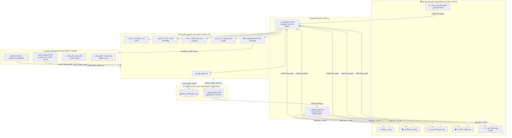
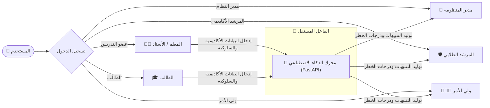
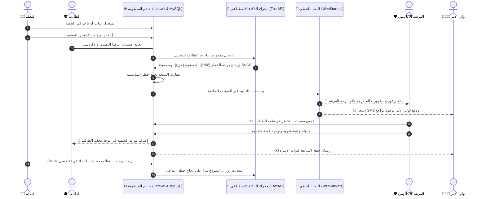

# الدليل الشامل لاستخدام النظام (الإصدار الاحترافي v2.0)
## المنصة الذكية لتحليل سلوك الطلاب والتنبؤ بالتعثر الأكاديمي والانسحاب الدراسي
### Smart Platform for Student Behavior Analysis & Academic Dropout Prediction (SBA Platform)

---

## 1. مقدمة ونظرة عامة على المنظومة

تُعد منصة **التحليل السلوكي الذكي (SBA)** منظومة تعليمية متقدمة مُصممة للمدارس والجامعات، تعتمد على تقنيات الذكاء الاصطناعي وخوارزميات التعلم الآلي للكشف المبكر عن مؤشرات التعثر الأكاديمي، الانقطاع عن الحضور، والتحولات السلوكية غير المعتادة. يتيح النظام لجميع الأطراف المعنية (الإدارة، المرشدين، المعلمين، الطلاب، وأولياء الأمور) اتخاذ إجراءات تدخّل استباقية وموجهة بدقة قبل وصول الطالب لمرحلة الخطر أو التسرب الدراسي.

---

### 🏛️ مخطط الهيكلية التقنية وتدفق البيانات الشامل

---

## 2. دليل الاستخدام التفصيلي حسب كل مستخدم (الأدوار الستة)

تتفاعل في المنظومة **ستة أدوار رئيسية**: خمسة أدوار بشرية ونظام ذكاء اصطناعي مستقل يعمل في الخلفية.

---

### 👑 1. مدير النظام العام (`admin`)

يمتلك مدير النظام أعلى مستوى من الصلاحيات لإدارة المؤسسات، الحسابات، ضبط خوارزميات التنبيه، ومراقبة الامتثال والخصوصية.

#### الوظائف الرئيسية وكيفية استخدامها:
1. **لوحة التحكم المركزية (`/admin`)**:
   - **مؤشرات الأداء العامة**: متابعة إجمالي عدد الطلاب، متوسط نسبة الحضور العام للمؤسسة، عدد الطلاب المعرضين للتعثر، والمقررات النشطة.
   - **الرسوم البيانية التفاعلية**: تحليل مسار الحضور السنوي، ونسب التعثر موزعة حسب المقررات والتخصصات لاكتشاف الفجوات التعليمية.
2. **إدارة الحسابات والصلاحيات (`/admin/accounts`)**:
   - **إنشاء وتعديل الحسابات**: إضافة المعلمين، المرشدين، والطلاب وتحديد أدوارهم وصلاحياتهم بدقة عبر مصفوفة Spatie RBAC.
   - **الاستيراد الجماعي**: إمكانية رفع بيانات المستخدمين دفعة واحدة عبر ملفات Excel/CSV.
3. **إدارة المؤسسات وهيكليتها (`/admin/institutions`)**:
   - **أنماط التشغيل**: التبديل السلس بين **نمط المدارس** (مراحل → صفوف → شُعب) و**نمط الجامعات** (كليات → أقسام → برامج أكاديمية).
   - **ضبط عتبات الخطر (Risk Thresholds)**: ضبط النسبة المئوية المخصصة (مثال: 75% أو 80%) التي تُطلق التنبيهات الآلية لكل مؤسسة.
4. **سجلات التدقيق والمراقبة (`/admin/settings`)**:
   - **سجل الأنشطة والامتثال (FERPA Logs)**: جدول مفصل وقابل للبحث يرصد من وصل إلى بيانات أي طالب، والتاريخ، وسبب الاطلاع لحماية الخصوصية.

---

### 🛡️ 2. المرشد الطلابي والأكاديمي (`advisor`)

يُعد المرشد الأكاديمي محور عمليات التدخل والدعم، حيث يتابع الحالات الحرجة ويقود خطط العلاج والمتابعة الفردية.

#### الوظائف الرئيسية وكيفية استخدامها:
1. **قائمة الطلاب تحت المتابعة (`/advisor`)**:
   - **الفرز حسب درجة الخطر**: تصفية الطلاب آلياً استناداً إلى **مؤشر الخطر بالذكاء الاصطناعي (0–100%)** ومستويات التصنيف (**حرج Critical، مرتفع High، متوسط Medium، منخفض Low**).
   - **شارات الإنذار الفوري**: الاطلاع على مسببات الخطر السريعة (تراجع الحضور، انخفاض درجات الواجبات، ملاحظات سلوكية).
2. **الملف الشامل 360 درجة للطالب (`/advisor/student`)**:
   - **عوامل التفسير الرياضي (SHAP Factors)**: معرفة الوزن الرياضي الدقيق لكل مؤشر في تقييم الطالب (مثال: `+34% غياب مفاجئ`، `+22% رسوب في اختبار الرياضيات 1`).
   - **السجل التاريخي للمعدل**: متابعة تطور درجات الطالب وسجل ملاحظات المعلمين السابقة.
3. **إدارة وجدولة خطط التدخل**:
   - **إنشاء خطة دعم**: جدولة جلسات تقوية فردية، إرشاد نفسي، أو اجتماعات مع الأسرة.
   - **تسجيل نتائج التدخل**: توثيق مدى تحسن الطالب بعد المتابعة؛ مما يغذي خوارزمية الذكاء الاصطناعي لرفع دقتها لاحقاً.
4. **صندوق الإنذار المبكر والمراسلات (`/advisor/inbox` / `/advisor/communications`)**:
   - استقبال التنبيهات الفورية والتواصل المباشر مع أولياء الأمور والمعلمين عبر محادثات موثقة.

---

### 👨‍🏫 3. عضو هيئة التدريس والمعلم (`teacher`)

يقوم المعلم بإدارة الفصول اليومية، رصد الحضور، تسجيل الدرجات، والإبلاغ المباشر عن أي تراجع سلوكي أو أكاديمي.

#### الوظائف الرئيسية وكيفية استخدامها:
1. **لوحة أداء الشُعب الدراسية (`/teacher`)**:
   - **محدد المقررات**: التبديل الفوري بين الشُعب الدراسية لعرض متوسط الدرجات ونسب الحضور التجميعية.
   - **مخطط سرعة الإنجاز والحضور**: رسم بياني أسبوعي يقارن بين متوسط استيعاب الطلاب ومعدل التزامهم بالحضور.
2. **رصد الحضور والغياب اليومي (`/teacher/attendance`)**:
   - تسجيل حالات (حاضر، غائب، متأخر، معذور) بنقرة واحدة وحفظها في قاعدة بيانات MySQL.
3. **رصد الدرجات والتقييمات (`/teacher/grades`)**:
   - إدخال درجات الاختبارات القصيرة، الأنشطة، والامتحانات النصفية التي تنتقل تلقائياً لنموذج التحليل.
4. **تقارير الملاحظات السلوكية (`/teacher/incidents`)**:
   - رفع إشعار فوري لمرشد الفصل عند ملاحظة تشتت، عدم مشاركة، أو سلوك غير معتاد.
5. **تصدير التقارير المعتمدة**:
   - استخراج كشوفات درجات وحضور رسمية بصيغة PDF أو Excel جاهزة للطباعة والاعتماد.

---

### 🎓 4. الطالب (`student`)

تمنح بوابة الطالب الشفافية الكاملة لمتابعة مساره الأكاديمي، مهامه القادمة، وتلقي توصيات دراسية ذكية تدعم تفوقه.

#### الوظائف الرئيسية وكيفية استخدامها:
1. **لوحة الإنجاز الأكاديمي (`/student`)**:
   - **المسار التراكمي للمعدل (GPA)**: مقارنة المعدل الحالي بالأهداف الأكاديمية المستهدفة لهذا الفصل.
   - **حلقة الالتزام بالحضور**: متابعة نسبة الحضور الشخصية والتأكد من عدم تجاوز الحد المسموح للغياب.
2. **المهام والمواعيد الهامة (`/student/alerts`)**:
   - استعراض مواعيد الاختبارات القادمة، وجلسات الإرشاد المجدولة، والواجبات المعلقة.
3. **التسجيل الذاتي ومخطط التخرج (`/student/registration`)**:
   - اختيار المقررات المتاحة للتسجيل ومتابعة نسبة إنجاز متطلبات الخطة الدراسية.
4. **استبيانات جودة التعلم والصحة النفسية (`/student/settings`)**:
   - الإجابة على استبيانات دورية لمعرفة مستوى الرضا والضغط الدراسي (تُعالج آلياً عبر محرك NLP).
5. **المساعد الذكي (SBA AI Assistant)**:
   - طرح الأسئلة الأكاديمية، الاستفسار عن اللوائح، وطلب مقترحات لتنظيم أوقات المذاكرة.

---

### 👨‍👩‍👧 5. ولي الأمر والأسرة (`parent`)

تمكّن البوابة أولياء الأمور من الشراكة الفعالة مع المدرسة أو الجامعة لضمان الاستقرار التعليمي لأبنائهم.

#### الوظائف الرئيسية وكيفية استخدامها:
1. **محدد الأبناء الموحد (`/parent`)**:
   - التبديل الفوري بين ملفات الأبناء المسجلين من شاشة واحدة دون الحاجة لحسابات متعددة.
2. **سجل التنبيهات اللحظي**:
   - تلقي إشعارات فورية في حال غياب الابن عن حصة دراسية أو انخفاض درجاته في اختبار معين.
3. **التقارير الدورية الرسمية**:
   - تنزيل التقارير الشهرية الشاملة وملخصات الأداء الأكاديمي بصيغة PDF.
4. **التواصل المباشر مع المرشد (`/parent/communications`)**:
   - إرسال الرسائل والاستفسارات مباشرة للمرشد المسؤول عن متابعة الابن.
5. **إدارة الخصوصية وقنوات الإشعار (`/parent/settings`)**:
   - التحكم في الموافقة على التحليل السلوكي بالذكاء الاصطناعي وتحديد قنوات استلام التنبيهات (رسائل نصية SMS، بريد إلكتروني، إشعارات التطبيق).

---

### 🤖 6. محرك الذكاء الاصطناعي المستقل (Python / FastAPI Microservice)

يعمل المحرك الذكي في الخلفية بشكل مؤتمت بالكامل دون الحاجة لتدخل يدوي:
1. **التنبؤ بالتعثر (XGBoost / LightGBM)**: فحص مئات المتغيرات الأكاديمية والسلوكية لتحديد الطلاب المعرضين للخطر بدقة تفوق 90%.
2. **التفسير الرياضي (SHAP Engine)**: استخراج الأسباب الحقيقية التي دفعت الخوارزمية لرفع مؤشر الخطر لكل طالب.
3. **معالجة اللغات الطبيعية (NLP)**: تحليل نصوص الاستبيانات لكشف مشاعر الإحباط أو الضغط وتقديم إجابات ذكية عبر الشات بوت.
4. **إعادة التدريب المستمر**: تحسين النماذج دورياً استناداً إلى نتائج التدخلات الناجحة بالمؤسسة.

---

## 3. المخطط التفاعلي لرحلة العمليات من الرصد إلى التدخل

يوضح المخطط التالي كيفية انتقال البيانات بسلاسة من لحظة إدخال المعلم للغياب وحتى اكتمال خطة الدعم وإعادة تدريب النموذج:

---

## 4. جدول الروابط السريعة ومسارات المنظومة

| البوابة | الرابط الأساسي | الصفحات والمزايا المتوفرة |
|---|---|---|
| **الرئيسية العامة** | `/` | الصفحة التعريفية، محاكي الذكاء الاصطناعي التفاعلي، طلب العرض، والمميزات |
| **بوابة الدخول** | `/login` | تسجيل الدخول الآمن، التوجيه التلقائي حسب الدور، وإدارة الجلسات |
| **بوابة الإدارة** | `/admin` | النظرة العامة، إدارة الحسابات (`/admin/accounts`)، المؤسسات (`/admin/institutions`)، الإعدادات (`/admin/settings`) |
| **بوابة المرشد** | `/advisor` | قائمة المعرضين للخطر، صندوق الإنذار (`/advisor/inbox`)، المراسلات (`/advisor/communications`)، ملف الطالب 360 (`/advisor/student`) |
| **بوابة المعلم** | `/teacher` | لوحة الفصل، رصد الدرجات (`/teacher/grades`)، الحضور (`/teacher/attendance`)، الملاحظات (`/teacher/incidents`) |
| **بوابة الطالب** | `/student` | لوحة الطالب، التنبيهات (`/student/alerts`)، المقررات (`/student/academics`)، التسجيل (`/student/registration`) |
| **بوابة الأسرة** | `/parent` | لوحة المتابعة، محدد الأبناء، مراسلة المرشد (`/parent/communications`)، الإعدادات والموافقات (`/parent/settings`) |

---

## 5. معايير الأمان والخصوصية المتبعة

- **التشفير والحماية**: تشفير كلمات المرور باستخدام خوارزمية Bcrypt، واستخدام توكنات Bearer المشفرة عبر Laravel Sanctum.
- **حماية البيانات وقانون FERPA**: تقييد صلاحيات الاطلاع وتوثيق جميع عمليات الاستعلام في سجلات مراقبة غير قابلة للتعديل.
- **بوابة الموافقات المسبقة**: عدم تشغيل خوارزميات التحليل الذكي إلا بعد استيفاء موافقة الطالب الصريحة أو ولي أمره للقُصّر.
- **دعم اللغة العربية والخطوط الحديثة**: تطبيق معايير RTL الشاملة واعتماد خط **Cairo** المعتمد لكافة النصوص العربية لضمان تجربة بصرية فائقة.
